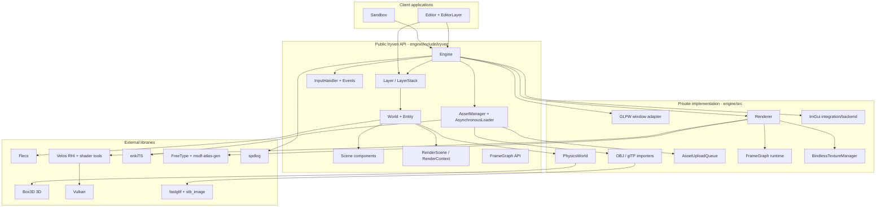
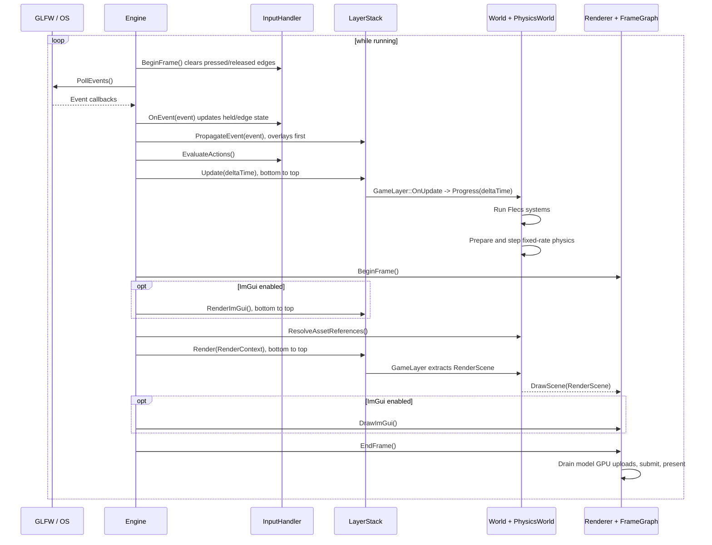
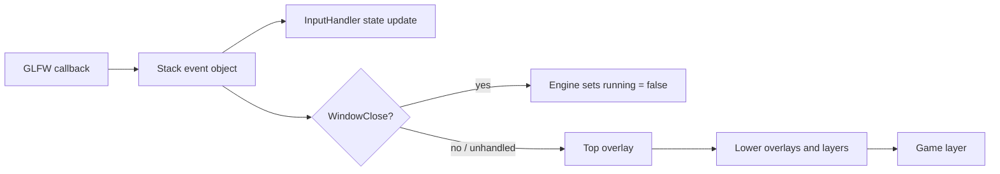
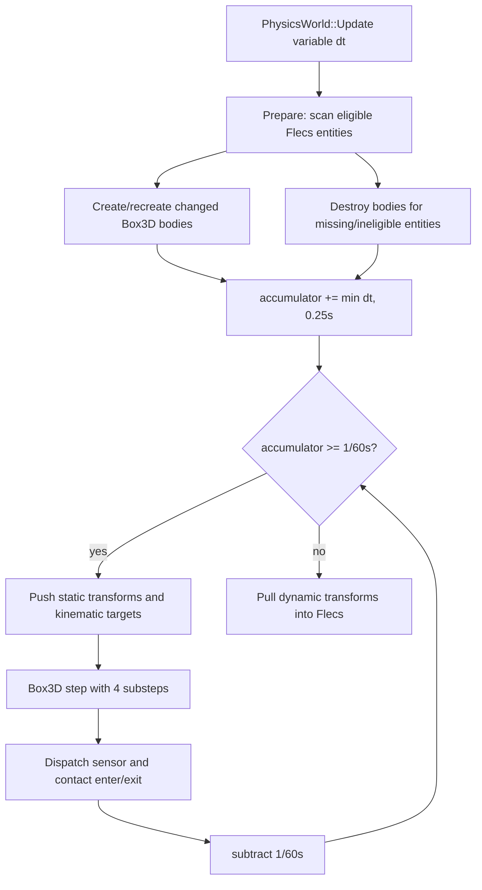
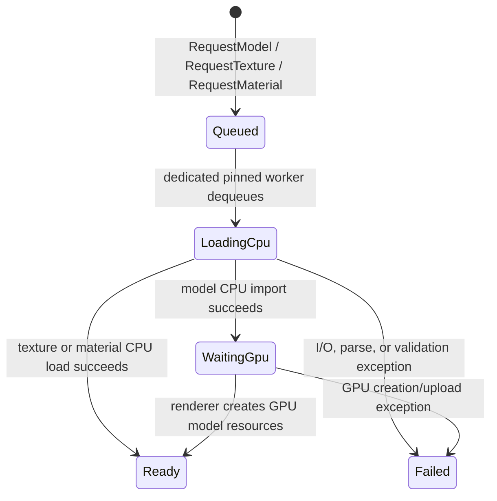
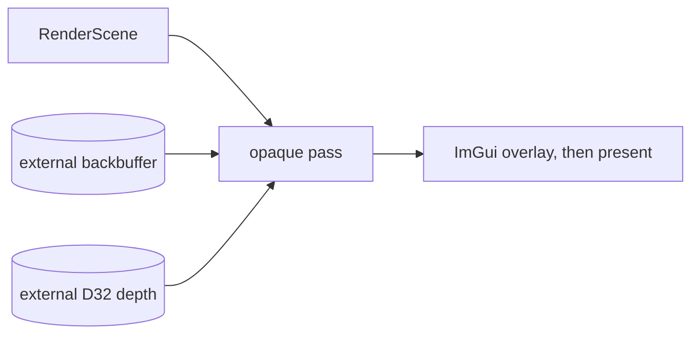

# Iryven Engine Architecture

> A source-backed guide to how the engine works today.

**Snapshot:** local working tree inspected on 2026-09-10, based on `main` at `83600eb`. The working tree contained uncommitted engine and editor changes, so this document describes the inspected files rather than only the committed revision.

## 1. Purpose and reading guide

Iryven is a small C++20 3D engine built as a static library. It owns the application loop, window, input state, ECS world, physics bridge, asset caches, render scheduling, Vulkan renderer, and optional ImGui lifecycle. Games and tools extend it with layers and Flecs systems.

This document answers four kinds of questions:

| If you want to understand... | Start here |
|---|---|
| Who owns what and how a frame moves | [Architecture at a glance](#2-architecture-at-a-glance) and [Frame lifecycle](#4-frame-lifecycle) |
| Gameplay state, entities, components, and physics | [World and ECS](#7-world-ecs-and-scene-components) and [Physics](#8-physics) |
| Models, textures, async loading, and GPU upload | [Asset system](#9-asset-system) |
| Frame graph, Vulkan resources, PBR, text, and ImGui | [Rendering boundary](#10-rendering-boundary) through [ImGui](#14-imgui-integration) |
| Where to make a particular change | [Change map](#19-change-map) |
| Current risks and incomplete areas | [Known constraints](#20-known-constraints-and-architectural-pressure-points) |

The most important mental model is:

> `Engine` schedules work, `World` owns simulation state, `RenderScene` is the hand-off value, and `Renderer` owns GPU state.

## 2. Architecture at a glance



### Architectural layers

| Layer | Main code | Responsibility | May depend on |
|---|---|---|---|
| Client | `sandbox/`, `editor/` | Defines game/tool behavior and scene content | Public Iryven API; editor also uses ImGui and GLFW directly |
| Facade and scheduling | `engine.h`, `core/` | Lifetime, main loop, layers, event propagation, optional UI | Window, input, assets, renderer |
| Simulation | `world.*`, `entity.h`, `scene/components/` | Authoritative entity/component state and system execution | Flecs, physics bridge |
| Content | `asset_manager.*`, `assets/` | CPU asset representation, import, caching, asynchronous state | fastgltf, stb_image, enkiTS, MSDF libraries |
| Render-facing data | `rendering/render_*.h` | Backend-independent per-frame scene description | GLM and immutable asset handles |
| Render scheduling | `framegraph.*` | Pass/resource graph, allocation, transitions, queue synchronization | Velos RHI types |
| GPU backend | `renderer/` | Vulkan device/swapchain, pipelines, descriptors, uploads, draws | Velos RHI, Vulkan, shader reflection |
| Platform | `platform/` | Window creation and OS input translation | GLFW |

The public/private boundary is deliberate for the main renderer: clients receive `RenderContext`, not `Renderer`, and cannot access its Vulkan device. The frame graph is an exception: it is public and directly exposes Velos RHI types.

## 3. Repository and build structure

```text
Iryven/
|- engine/
|  |- include/iryven/       Public headers
|  `- src/                  Private implementation
|     |- assets/            Import and async loading
|     |- core/              Engine, layers, logging, ImGui lifecycle
|     |- input/             Input state and action evaluation
|     |- physics/           Flecs <-> Box3D synchronization
|     |- platform/glfw/     Window and raw event source
|     |- renderer/          Concrete GPU backend
|     |- rendering/         Primitive meshes and frame graph
|     `- world/             ECS world and render extraction
|- assets/shaders/internal/ Built-in GLSL shaders
|- editor/                  ImGui scene editor client
|- sandbox/                 Example/game client
|- tests/                   Assert-based smoke/integration executable
|- premake/                 Dependency project definitions
`- premake5.lua             Workspace and project definitions
```

### Build products

`premake5.lua` creates four projects:

| Project | Kind | Contents |
|---|---|---|
| `Iryven` | Static library | Engine public headers, implementation, built-in ImGui backends, shaders |
| `Sandbox` | Console application | Example game/client |
| `Editor` | Console application | ImGui editor client |
| `IryvenTests` | Console application | Smoke and integration checks |

Configurations are `Debug`, `Release`, and `Profile`. `DebugLivePP` is added only when `external/LivePP` exists. `Profile` enables Tracy through `TRACY_ENABLE`. The build requires `VULKAN_SDK`; GLSL vertex and fragment files are compiled to SPIR-V by `glslc` before runtime. The runtime still performs shader reflection through Velos.

Direct dependencies are:

| Dependency | Role |
|---|---|
| Velos | Render hardware interface, Vulkan backend, shader compilation/reflection |
| GLFW | Window creation and event callbacks |
| Flecs | ECS storage, queries, systems, reflection, JSON serialization |
| Box3D | 3D rigid-body simulation, contacts, sensors |
| GLM | Vectors, matrices, quaternions, projections |
| enkiTS | Worker scheduler used by asynchronous loading |
| fastgltf | `.gltf`/`.glb` parsing and accessor traversal |
| stb_image | Texture decoding |
| FreeType + msdfgen/msdf-atlas-gen | Font loading and MTSDF atlas generation |
| spdlog | Core and client logging |

## 4. Frame lifecycle

`Engine::Run()` is the only application loop. It uses variable wall-clock delta time and does not cap the render rate.



Detailed ordering matters:

1. Input edge flags are cleared.
2. GLFW events update `InputHandler` immediately and are then offered to layers.
3. Named input actions are evaluated from the updated state.
4. Layers update in insertion order. The engine-owned `GameLayer` is first, so Flecs systems and physics normally run before client overlays update.
5. The renderer acquires the swapchain image. A minimized/zero-sized window skips the entire render half of the frame.
6. ImGui widgets are built before scene rendering.
7. Completed asynchronous model handles are resolved into `MeshRenderer::model`.
8. Layers render in insertion order; `GameLayer` extracts and submits the world first.
9. ImGui is composited onto the loaded backbuffer.
10. Pending GPU model uploads are drained, the backbuffer transitions to `Present`, and the frame is submitted.
11. The initially hidden window is shown only after the first successful presentation, avoiding startup flicker.

Physics is fixed at 60 Hz internally, but Flecs systems receive the variable render-frame delta. There is no interpolation between physics states.

## 5. Core engine and ownership

### `Engine`

Files: `engine/include/iryven/engine.h`, `engine/src/core/engine.cpp`

`Engine` is both facade and composition root. Construction order is:

1. Initialize logging.
2. Create a hidden GLFW window.
3. Create `AsynchronousLoader`, giving it references to `AssetManager` and `AssetUploadQueue`.
4. Create the private `Renderer`, giving it the window and upload queue.
5. Connect the window event callback to `Engine::OnEvent`.
6. Optionally create ImGui integration.
7. Install the engine-owned `GameLayer`, `UILayer`, and `DebugLayer`.

The declaration order in `Engine` is intentionally arranged so destruction happens safely in reverse: application layers are detached and destroyed, then ImGui shuts down, then the renderer, then the asynchronous loader, upload queue, asset cache, and finally the window. Raw pointers to the three built-in layers are non-owning aliases into `LayerStack`.

`CreateWorld()` replaces the current world with a new `World`. Any external `World&`, `Entity`, component reference, or Flecs handle belonging to the old world becomes invalid and must not be retained.

`EngineConfig` currently controls title, initial logical dimensions, and whether ImGui is enabled. It does not expose graphics API, validation, vsync, frame count, or physics configuration.

### `Layer` and `LayerStack`

Files: `layer.h`, `layer_stack.h`, `core/layer_stack.cpp`, `layers/*.h`, `core/game_layer.cpp`

The stack is split at `overlayBegin_`:

```text
[ ordinary layers ... | overlays ... ]
                      ^ overlayBegin_
```

- Ordinary layers insert immediately before the first overlay.
- Overlays append at the top.
- `OnAttach` runs synchronously when pushed.
- `OnDetach` runs when popped and, for remaining layers, in reverse order during stack destruction.
- Update, scene render, and ImGui render run bottom-to-top.
- Events run top-to-bottom and stop at the first layer returning `true`.

The engine prevents removal of its `GameLayer`, `UILayer`, and `DebugLayer`. `UILayer` and `DebugLayer` are currently named extension points with no behavior. `GameLayer` owns exactly one `World`, can pause simulation, resolves asynchronous model references, and converts the world to a `RenderScene` during `OnRender`.

## 6. Events and input

### Event model

Files: `events/event.h`, `application_event.h`, `keyboard_event.h`, `mouse_event.h`

Events are short-lived polymorphic objects created on the stack inside GLFW callbacks. `EventType` supports application, keyboard, mouse-button, cursor, and scroll events. Category flags allow broad filtering. `EventDispatcher` checks the runtime type and invokes a typed callback; the callback's Boolean result becomes the handled state.

The propagation path is:



Input observes all events before a layer can consume them. Consequently, consuming a key event prevents lower layers from reacting to the event object, but does not prevent the global key state from changing.

### `InputHandler`

Files: `input/input.h`, `input/input_action.h`, `input/input.cpp`, platform key/mouse enums

Input uses fixed-size bitsets for current, pressed-this-frame, and released-this-frame keyboard and mouse state. A press edge is recorded only when the input was previously up; GLFW repeat events therefore keep `down` true without creating additional press edges.

Named actions are an OR of key and mouse bindings. `EvaluateActions()` calculates `down`, `pressed`, and `released`, then invokes every registered `OnActionPressed` callback when the action has a press edge. There is currently no public action-value query, release callback, axes, chords, rebinding persistence, gamepad support, or cursor/scroll state in `InputHandler`; cursor and scroll remain event-only.

`input_map.h/.cpp` are currently empty placeholders.

## 7. World, ECS, and scene components

### `World` and `Entity`

Files: `world.h`, `world/world.cpp`, `entity.h`

`World` owns a `flecs::world` and a private `PhysicsWorld` tied to it. `Entity` is a lightweight wrapper around `flecs::entity`; its templated `Add`, `Get`, `Has`, and `Remove` methods directly manipulate Flecs storage.

Only entities created through `World::CreateEntity` receive the private `SceneEntityTag`. `ForEachEntity` deliberately filters on that tag so editor traversal does not enumerate Flecs metadata, systems, or internal entities.

`AddSystem<Components...>` constructs a named Flecs system. Its callback receives Flecs' current `delta_time()` plus mutable component references. The convenient wrapper does not expose phases, dependencies, staging, entity identity, optional terms, or multithread scheduling; advanced code can use `GetFlecsWorld()` directly.

`World::Progress(deltaTime)` first runs `flecs::world::progress`, then advances physics. This means:

- Gameplay systems read the transform produced by the previous physics update.
- Systems may change static/kinematic transforms before the same frame's physics update.
- Dynamic transforms are overwritten from Box3D after fixed stepping.

### Scene-to-render extraction

`ExtractRenderScene()` performs four ECS queries:

| Query | Output | Rules |
|---|---|---|
| `Transform + Camera` | Optional `RenderCamera` | First primary camera encountered wins; view is inverse world transform |
| `Transform + MeshRenderer` | `RenderObject[]` | Raw meshes become one object; models recursively expand nodes and primitives |
| `Transform + Light` | `RenderLight[]` | Disabled lights skipped; local `-Z` rotated into world direction |
| `UIText` | `RenderText[]` | Empty text and invalid fonts skipped |

The model walker multiplies transforms as `entityTransform * parentNodeTransform * nodeLocalTransform`. Each mesh primitive becomes one render object and carries its index range and vertex offset. An entity-level material overrides the imported primitive material; otherwise the primitive's imported material is used.

No visibility culling, level-of-detail selection, spatial partitioning, render sorting, or instancing happens during extraction.

### Components

Files: `scene/components/`

| Component | Meaning and implementation details |
|---|---|
| `Transform` | Position, quaternion rotation, and scale. Matrix order is translation * rotation * scale. `FromMatrix` uses GLM decomposition and normalizes rotation. |
| `Camera` | Vertical FOV in degrees, near/far planes, and `primary`. Multiple primaries are allowed; query order decides which renders. |
| `MeshRenderer` | Holds either immutable `MeshData`, immutable `Model`, or an asynchronous model `AssetHandle`, plus optional material override. Constructors validate immediate inputs. |
| `Light` | Directional, point, or spot; color, intensity, range, cone angles, enabled flag. |
| `RigidBody` | Static, kinematic, or dynamic; gravity scale and all-axis fixed rotation. |
| `Collider` | Box, sphere, or capsule shape; physical material, sensor flag, 64-bit category/mask, and enter/exit callbacks. Factory methods fill shape-specific values. |
| `UIText` | Font handle, UTF-8 string, pixel position, font size, and color. It is screen-space and does not require a `Transform`. |

### Scene serialization

`SerializeScene` and `DeserializeScene` delegate to Flecs JSON. GLM vectors/quaternions, `Color`, `Transform`, `Camera`, `Light`, and `RigidBody` have reflected members registered in the `World` constructor. `MeshRenderer`, `Collider`, and `UIText` are registered as component types but their non-trivial members are not reflected, so they serialize as presence/null rather than usable content.

Deserialization merges into the existing world; it does not clear it. Parse failure may therefore leave partial changes. The implementation rejects missing files, empty/whitespace content, embedded NULs, parse failures, and non-whitespace trailing content.

The editor compensates for non-serializable render resources with its own reflected `EditorRenderable` recipe and reconstructs primitive meshes/materials after load.

## 8. Physics

Files: `engine/src/physics/physics_world.h/.cpp`

`PhysicsWorld` is a private adapter. No Box3D handle crosses the public API. An entity participates only when it has all three components: `Transform`, `RigidBody`, and `Collider`.



Important implementation details:

- Gravity is `(0, -10, 0)`.
- The fixed timestep is `1/60` second with four Box3D substeps.
- A frame contributes at most `0.25` second to avoid an unbounded spiral of death.
- Static bodies are teleported from ECS on every fixed step.
- Kinematic bodies use target transforms so the solver derives velocity and transfers motion.
- Dynamic bodies are never pushed from ECS during normal updates; Box3D position and rotation are pulled back after stepping.
- `Transform::scale` does not affect physics. Collider dimensions are explicit and independent.
- Physical changes to `RigidBody` or `Collider` are detected by value comparison and rebuild the body. Callback changes do not force a rebuild because dispatch reads callbacks live from Flecs.
- Removing any required component destroys the backend body on the next update.
- Sensor callbacks fire only on the sensor entity. Collision callbacks are dispatched symmetrically to both entities.
- Shape-to-entity lookup scans the body map linearly for each event.

`World::ResetPhysics()` destroys and rebuilds the entire physics bridge. The editor uses this after restoring a pre-play snapshot.

## 9. Asset system

### CPU representations and handles

Files: `model.h`, `material.h`, `texture.h`, `handle.h`, `assets/`

Runtime resource objects are immutable through shared handles:

- `ModelHandle = shared_ptr<const Model>`
- `MaterialHandle = shared_ptr<const Material>`
- `TextureHandle = shared_ptr<const Texture>`
- `FontHandle = shared_ptr<const Font>`

The generic numeric `Handle<Tag>` is used for asynchronous identity; `AssetHandle` is a tagged 64-bit ID where `UINT64_MAX` is invalid. Numeric handles do not own resources.

A `Model` contains contiguous vertex/index arrays, meshes and primitive ranges, materials, a local texture/sampler registry, a node hierarchy, and scene roots. `Model::IsValid()` performs range and reference validation but does not detect node cycles. Renderer traversal assumes an acyclic hierarchy.

`Material` implements the core metallic-roughness PBR factors and five texture roles. Texture indices are local to the containing model's `TextureRegistry`, not global GPU descriptor indices.

### `AssetManager`

Files: `asset_manager.h`, `assets/asset_manager.cpp`

`AssetManager` is a mutex-protected path cache. Paths are weakly canonicalized, falling back to absolute lexical normalization. Models, materials, sRGB textures, and linear textures are separate maps. The color-space split is important: the same image path may legitimately produce two cached textures.

The loader checks the cache, performs I/O outside the mutex, and then uses `try_emplace`. Concurrent requests for the same uncached path can duplicate decode work, but converge on the first cached object.

Supported formats:

| Type | Support |
|---|---|
| Model | `.obj`, `.gltf`, `.glb` |
| Texture | Any stb_image-decodable format, converted to RGBA8 |
| Material | Custom line format with only `name` and `base_color` currently parsed |
| Font | Constructed directly as `Font`; not managed by `AssetManager` |

OBJ import supports positions, normals, positive/negative indices, arbitrary polygon fan triangulation, missing-normal generation, and bounds. It does not preserve UVs, materials, groups, smoothing groups, tangents, colors, or multiple meshes.

glTF import supports triangle primitives, generated indices, POSITION, NORMAL, TEXCOORD_0, TANGENT, COLOR_0, node transforms/hierarchy, scene roots, samplers, embedded/external images, and metallic-roughness PBR textures. Missing normals are generated. Base-color and emissive textures are sRGB; data textures are linear.

### `AsynchronousLoader`

Files: `assets/asynchronous_loader.h/.cpp`, `renderer/asset_upload_queue.*`



The scheduler creates at least two enkiTS task threads and dedicates the last one to a pinned request loop. Requests are deduplicated by normalized path, asset type, and texture color space. State and queues are protected by a mutex and condition variable.

Models require a GPU stage. The worker loads/caches the CPU `Model`, sets `WaitingGpu`, and enqueues an `AssetUploadRequest`. `Renderer::EndFrame` drains the queue, creates GPU resources, then calls success/failure callbacks to update state. `World::ResolveAssetReferences` sees `Ready` on a later frame and installs the `ModelHandle` into matching `MeshRenderer` components.

Textures and materials currently become `Ready` after CPU loading and do not enter the GPU queue. `AsynchronousLoader` exposes `GetModel`, but no equivalent public asynchronous getter for texture or material.

Destruction sets `stopping_`, wakes the worker, drains remaining queued requests, and then shuts down the scheduler. Since `Engine` destroys the loader before the referenced queue and cache, callbacks cannot outlive their owners during normal shutdown.

## 10. Rendering boundary

Files: `rendering/render_context.h`, `render_scene.h`, `render_object.h`, `render_camera.h`, `render_light.h`, `render_text.h`, `frame_data.h`

`RenderContext` has one operation: `DrawScene(const RenderScene&)`. This is the boundary between client/layer code and the backend. `Renderer` implements it privately.

`RenderScene` is a temporary value containing one optional camera and vectors of objects, lights, and texts. Its members hold shared immutable CPU resources, so the GPU backend can key caches by stable source pointer without owning gameplay entities.

This boundary prevents renderer code from querying or mutating Flecs. It also creates a natural future seam for render threading, snapshot buffering, headless tests, or a second backend, although the current code builds and consumes the snapshot synchronously on the main thread.

## 11. Frame graph

Files: `rendering/framegraph.h/.cpp`

The frame graph has two cooperating objects:

- `FrameGraphBuilder` owns node/resource records, name maps, render-pass registrations, and internally allocated RHI resources.
- `FrameGraph` owns the enabled-node list, compiled execution order, queue batches, timeline semaphores, and per-frame external waits.

### Compilation


Node names also select the registered `FrameGraphRenderPass` implementation. Inputs and outputs are matched by resource name. Duplicate node names and non-reference output names are rejected. Enabled nodes cannot consume outputs from disabled producers. Cycles are detected by comparing topological output size with enabled-node count.

Resource types are texture, buffer, attachment, and reference. An external resource's lifetime/handle belongs to the caller; an internal output is allocated and destroyed by the builder. `resizeWithSwapchain` internal textures can be recreated through `OnResize`.

Cross-queue internal resources are automatically marked concurrent. Cross-queue external resources must already declare `concurrentQueues`, otherwise compilation fails. Attachments are restricted to graphics queues.

### Execution

For each queue batch the graph:

1. Acquires a queue-specific command list.
2. Calls each pass's `PreRender`.
3. Transitions sampled textures and attachments to required layouts.
4. Configures dynamic rendering attachments, viewport, and scissor.
5. Calls the pass's `Render`.
6. Submits the batch with timeline-semaphore waits/signals.

All signals from non-graphics batches are exposed through `GraphicsSubmissionWaits()` so the renderer's final swapchain submission cannot present before asynchronous graph work completes.

The graph currently supports at most one color attachment and one depth attachment per pass because of the current Velos integration. It does not perform pass culling, resource aliasing, subresource tracking, automatic usage inference, barrier scheduling beyond image layouts, or JSON parsing (`Parse` is a stub).

### Live graph

Although the implementation can represent multiple passes and graphics/compute transitions, `Renderer` currently registers only one node/pass:



The external backbuffer and depth handles are patched into graph resources after each successful `BeginFrame`.

## 12. Renderer and GPU resource lifetime

Files: `renderer/renderer.h/.cpp`, `renderer/bindless_texture_manager.*`, `renderer/asset_upload_queue.*`

### Initialization

`Renderer` currently hard-codes a Vulkan Velos device with validation enabled, a two-buffer swapchain, two frames in flight, BGRA8 color, and D32 depth. It then creates:

- Depth image/view.
- A 4,096-entry bindless texture table.
- A 2x2 magenta/black missing texture in mandatory slot 0.
- Reflected glTF PBR and text pipeline layouts and pipelines.
- Two copies of frame/light/material buffers and binding sets.
- A font descriptor pool with 256 sets.
- The single-pass frame graph.

Projection uses GLM's right-handed, zero-to-one-depth perspective and flips projection Y for Vulkan.

### Opaque PBR pass

`OpaquePass::PreRender` uploads lights and materials, then frame matrices if a camera exists. `Render` draws every object only when a camera exists, then draws screen-space text even without a camera.

GPU limits and behavior:

| Resource | Current limit/behavior |
|---|---|
| Frames in flight | 2 |
| Lights | 128; additional lights are silently ignored |
| Materials per frame | 1,024 including default slot 0; overflow throws |
| Bindless textures | 4,096 including missing texture slot 0; exhaustion throws |
| Font binding sets | 256 in one pool |
| Color attachments | One per frame-graph pass |

Material slot 0 is an all-default white material. Other material slots are rebuilt every scene draw and keyed by `(Model*, Material*)`; including `Model*` is necessary because texture indices in `Material` are model-local. Push constants carry the model matrix and material slot. Each render object currently binds the pipeline/sets and emits an individual indexed draw.

The fragment shader implements a direct-light metallic-roughness BRDF using GGX distribution, Schlick-GGX geometry, and Schlick Fresnel. It supports directional, inverse-square/range-attenuated point, and conical spot lights; base color, metallic-roughness, normal, occlusion, and emissive textures; vertex color; and a small constant ambient term. There are no shadows, image-based lighting, transparency modes, tone mapping, gamma post-process, or light culling.

Back-face culling is disabled. The renderer does not frustum-cull, sort opaque objects, batch instances, or separate transparent geometry.

### CPU-to-GPU caches

GPU meshes, models, and fonts are cached by the raw address of their immutable shared source. Each cache record holds a `weak_ptr` back to that source:


Primitive `MeshData` uses CPU-visible vertex/index buffers and is destroyed when its weak source expires. Models additionally create images, views, samplers, bindless registrations, and vertex/index buffers. Text fonts create an uploaded MTSDF atlas plus one traditional descriptor set.

Model destruction is deferred with a monotonically increasing submission serial. Bindless slots and model GPU resources are not reused/destroyed until the frame that last referenced them has completed. The frame index is used to advance `completedSubmissionSerial_` when a frame slot is reused.

### Text rendering

`Font` loads printable ASCII (`U+0020` through `U+007E`) with FreeType, creates an MTSDF atlas at minimum scale 48 and pixel range 4, and generates it using four threads.

The renderer decodes UTF-8, falls back to `?` for glyphs not present in the atlas, handles CR/LF, expands every glyph into six screen-space vertices, creates a transient CPU-to-GPU vertex buffer for each text item, and destroys those buffers when the same frame-in-flight slot is reused. The text pipeline uses alpha blending and no depth test.

## 13. Platform and windowing

Files: `window.h`, `platform/window.cpp`, `platform/glfw/*`

`Window` is a narrow virtual interface over polling, dimensions, framebuffer dimensions, native handle, visibility, vsync state, and event callback. `CreateWindow` always returns `GlfwWindow` today.

The GLFW window is created with no client API, resizable, and initially hidden. GLFW callbacks translate raw key and mouse codes into Iryven enums and synchronously call the registered event function. Logical window dimensions and framebuffer dimensions are queried separately, which is correct for HiDPI displays.

`GlfwWindow` initializes and terminates GLFW per instance, so the implementation effectively assumes a single window. `SetVSync` only updates stored state; it does not recreate/update an existing swapchain. The cached framebuffer fields and `framebufferResized_` flag are not updated by callbacks; the renderer remains functional because it queries live framebuffer dimensions and compares them with the swapchain every frame.

## 14. ImGui integration

Files: `core/imgui_integration.*`, `renderer/imgui_renderer.*`

ImGui is optional and enabled by `EngineConfig::enableImGui`.

Responsibilities are split:

- `ImGuiIntegration` owns the ImGui context and GLFW platform backend. It starts UI frames and calls `ImGui::Render`.
- `ImGuiRenderer` owns the Vulkan backend initialization and emits ImGui draw data into the renderer's active command buffer.
- Layers only implement `OnImGuiRender`; they do not initialize a graphics backend.

ImGui is drawn after the world pass using `Load` on the existing backbuffer. The backend explicitly assumes Vulkan and two images in flight. The editor includes ImGui widget APIs and uses the native GLFW handle for cursor capture, which is a client-side platform abstraction leak.

## 15. Primitive geometry and math helpers

Files: `rendering/primitive_meshes.*`, `math/color.h`

`PrimitiveMeshes` generates unit, origin-centered cube, sphere, cylinder, cone, and XZ plane meshes. Cube and plane are static shared singletons. Sphere/cylinder/cone are regenerated for each call so segment/ring parameters can vary. Minimum segment/ring values are validated.

Generated primitives contain positions and normals, but not UVs or meaningful tangents. They therefore work with untextured materials; texture/normal mapping on these meshes would require extending generation.

`Color` wraps a linear `glm::vec4` and provides named constants. It does not encode or enforce color space; shader/material code must interpret values consistently.

## 16. Logging

Files: `log.h`, `core/log.cpp`, `formatters.h`

`Log::Init` creates two color-console spdlog loggers: `Iryven` for engine messages and `App` for client messages, both at trace level. Macros provide trace through fatal logging. A custom `fmt` formatter lets any `Event` subtype be logged through `ToString()`.

Initialization is called unconditionally by every `Engine` construction. spdlog named logger registration means multiple sequential/concurrent `Engine` instances in one process may need explicit logger cleanup or idempotent initialization.

## 17. Client applications

### Sandbox

Files: `sandbox/main.cpp`, `sandbox/development/`

The sandbox demonstrates intended client usage:

1. Construct `DevelopmentSession` for optional Live++ hot reload.
2. Construct `Engine`.
3. Request a model asynchronously and attach its `AssetHandle` to `MeshRenderer`.
4. Create ECS camera/light entities.
5. Register a Flecs system that reads `InputHandler` and updates camera motion.
6. Call `Engine::Run()`.

`DevelopmentSession` uses a PIMPL so Live++ headers and state remain isolated. Without `IRYVEN_WITH_LIVEPP`, it is a harmless empty RAII object.

### Editor

Files: `editor/main.cpp`, `editor_layer.*`, `editor_scene.*`

The editor is a client overlay, not a separate engine mode. It enables ImGui, pushes `EditorLayer`, and initially pauses `GameLayer` simulation. It provides hierarchy, component inspection, primitive/material recipes, camera navigation, JSON save/load, and play/stop.

Play mode saves and clones scene entities to Flecs prefabs, enables simulation, and on stop removes runtime-created entities, restores cloned components, resets physics, and repairs selected/camera handles. This is an editor-local snapshot mechanism, not a general runtime scene transaction or undo system.

`EditorRenderable` is a serializable recipe for procedural mesh choice and material factors. `ApplyEditorRenderable` regenerates immutable material objects and patches `MeshRenderer`; this is how the editor restores resources that Flecs JSON cannot serialize.

## 18. Tests and current coverage

File: `tests/smoke.cpp`

The single test executable uses `assert` and combines unit-style and integration-style checks. It covers:

- Color/transform math and primitive mesh validity.
- Asset caching, texture color spaces, OBJ and glTF import.
- Model hierarchy extraction into render objects.
- Scene JSON success/failure and merge behavior.
- Layer ordering and event consumption.
- Input edge/action behavior.
- Physics falling bodies, body recreation, sensors, and symmetric contacts.
- Frame-graph sorting, cycles, queue batching, concurrent resources, and real compute/graphics submission.
- Shader compilation/reflection and several renderer-adjacent data contracts.

Because checks are `assert`-based, a build configuration defining `NDEBUG` removes them. Some tests require GLFW, Vulkan, and a usable GPU/driver, so the suite is not currently a lightweight headless unit-test layer.

## 19. Change map

| Goal | Primary place to change | Also inspect |
|---|---|---|
| Change the main loop or frame ordering | `engine/src/core/engine.cpp` | `game_layer.cpp`, renderer `BeginFrame`/`EndFrame` |
| Add application lifecycle hooks | `Layer` and `LayerStack` | engine construction/destruction ordering |
| Add a component | `scene/components/` | `World` reflection, extraction, editor inspector, serialization tests |
| Add gameplay behavior | `World::AddSystem` client call or direct Flecs API | physics ordering if transforms are involved |
| Add a new input device/action form | `InputHandler`, event types | GLFW translation/callbacks |
| Add a model format | `AssetManager::LoadModel`, `model_importers.h` | `Model::IsValid`, tests |
| Expand material support | `Material`, importer, GPU material struct, fragment shader | serialization/editor UI and 80-byte GPU layout |
| Add an asynchronous asset type | `AsynchronousLoader` | `AssetUploadRequest`, renderer drain, world reference resolution |
| Add a render pass | Implement `FrameGraphRenderPass`, register it, add graph node | resource formats/usages and queue transitions |
| Add shadows | Light data, shadow resources/pass, material shader | frame graph and light limits |
| Add render culling/sorting | `World::ExtractRenderScene` or a new render-preparation stage | bounds already stored on model primitives |
| Add another graphics backend | Velos device selection and ImGui renderer | hard-coded Vulkan projection/backend assumptions |
| Make scenes round-trip fully | Component reflection or explicit scene schema | asset references, callbacks, editor recipes |
| Add multi-window support | GLFW lifetime manager and renderer ownership | Engine's single window/swapchain facade |

## 20. Known constraints and architectural pressure points

These are observations from the current implementation, not a proposed rewrite order.

### Boundaries that are working well

- `RenderScene` cleanly separates ECS/game state from GPU state.
- `RenderContext` keeps normal client layers away from the concrete renderer.
- Immutable shared CPU assets plus weak GPU-cache keys give simple ownership semantics.
- The async loader explicitly models CPU and GPU stages instead of hiding GPU work on a worker thread.
- Box3D handles stay private behind ECS components.
- Layer lifecycle and reverse event propagation are small and predictable.
- Frame-graph compilation validates many invalid configurations early.

### Current limitations to remember

1. **The renderer is monolithic.** Device/swapchain management, graph setup, PBR rendering, resource caches, text, asset upload, descriptor allocation, and retirement all live in `Renderer`.
2. **The frame graph is more capable than the active render pipeline.** Only one opaque pass is used; JSON parsing, aliasing, pass culling, richer barriers, and multiple color attachments are absent.
3. **Scene persistence is partial.** Render resources, collider properties/callbacks, and UI text contents do not round-trip through the engine's Flecs JSON registration.
4. **The public frame graph leaks the RHI.** This is acceptable for renderer extension code, but it is not backend-independent public API.
5. **Asset APIs are asymmetric.** Models have a complete async CPU-to-GPU path; texture/material requests stop at CPU-ready and have no async getters.
6. **GPU creation can stall the render thread.** Model/font creation performs resource creation and upload-context flushes synchronously when resolved/drained.
7. **No render preparation optimization exists.** Extraction recursively expands all model nodes every frame; rendering issues one draw per object with repeated binding calls.
8. **Physics performs broad scans.** Eligible ECS entities are scanned each frame, physical component copies are compared, and each contact's shape lookup is linear in body count.
9. **Physics and rendering have different timing models.** Flecs uses variable delta, physics uses fixed steps, and there is no interpolation.
10. **Some configuration is hard-coded.** Vulkan, validation, formats, frame count, capacities, gravity, fixed timestep, and shader paths are compile-time/source choices.
11. **Sampler fidelity is incomplete.** Renderer conversion collapses mirrored repeat into repeat, reduces mip filter variants to nearest/linear, and does not generate texture mip chains despite sampler metadata.
12. **Font cache descriptor sets are not individually recycled.** Expired font images/samplers are destroyed, but their binding sets remain allocated from the fixed pool until pool shutdown.
13. **Window state has redundant/inert fields.** Resize is detected through live dimension comparison rather than the exposed resize flag; changing vsync after swapchain creation has no effect.
14. **Multiple primary cameras are nondeterministic by intent.** The first Flecs query result wins; no priority or validation exists.
15. **The Linux build path deserves verification.** Premake unconditionally constructs `VULKAN_SDK/Bin/glslc.exe` even though a Linux `gmake2` path is advertised.

### A practical refactoring sequence

If the goal is understanding and safe evolution rather than a rewrite, the lowest-risk sequence is:

1. Add focused tests around the current frame and ownership contracts.
2. Extract renderer responsibilities into device/frame, scene pass, resource cache, and upload/retirement units without changing behavior.
3. Define an explicit scene file schema for serializable data and asset references instead of serializing the entire Flecs world.
4. Complete one asset path end-to-end for textures/materials or narrow the public API until needed.
5. Introduce a render-preparation stage for culling, sorting, and stable material/instance batches.
6. Expand the frame graph only when a real second pass (for example shadows or post-processing) exercises the abstraction.

## 21. Core invariants

When modifying the engine, preserve these contracts unless the architecture is deliberately changed:

- A `Renderer::DrawScene` call is valid only between successful `BeginFrame` and `EndFrame`.
- A model asset is `Ready` only after CPU loading and successful GPU resource creation.
- Asset paths are normalized before cache/deduplication comparisons.
- A physics body exists only for entities with `Transform + RigidBody + Collider`.
- Static/kinematic transforms flow ECS to physics; dynamic transforms flow physics to ECS.
- Clients own layers through `Engine`/`LayerStack`; raw built-in layer pointers do not own.
- Render data contains no Flecs or Box3D handles.
- GPU cache entries must not retain strong references that keep abandoned CPU assets alive.
- Bindless slots/resources referenced by submitted work are retired only after that submission completes.
- External frame-graph resources are never destroyed by the graph builder.
- Frame-graph node and resource names are identities, not merely debug labels.
- Imported model node graphs must be acyclic for recursive render extraction.

## 22. Minimal end-to-end example

```cpp
#include <iryven/iryven.h>

int main() {
    Iryven::Engine engine({ .title = "My Game" });

    auto modelAsset = engine.GetAsyncLoader().RequestModel("assets/ship.glb");

    auto ship = engine.GetWorld().CreateEntity("Ship");
    ship.Add<Iryven::Transform>();
    ship.Add<Iryven::MeshRenderer>(modelAsset);

    auto camera = engine.GetWorld().CreateEntity("Camera");
    camera.Add<Iryven::Transform>(Iryven::Transform{
        .position = {0.0f, 2.0f, 8.0f}
    });
    camera.Add<Iryven::Camera>();

    engine.GetWorld().AddSystem<Iryven::Transform>(
        "Move",
        [](float dt, Iryven::Transform& transform) {
            transform.position.x += dt;
        });

    engine.Run();
}
```

The model request immediately returns a numeric `AssetHandle`. The worker imports and caches the CPU model, the renderer creates its GPU resources at the end of a frame, the loader marks it ready, and a later frame replaces `MeshRenderer::modelAsset`-only behavior with the resolved `ModelHandle`. From then on, `World::ExtractRenderScene` expands the model hierarchy into draw records every frame.
